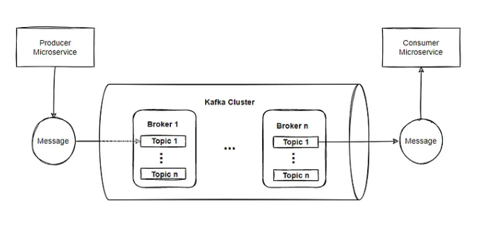

# Asynchronous Communication between Microservices with Kafka
This mono repo contains two microservices projects wich I used to implement Asynchronous communication between them, using Kafka.


## Prerequisites
- Docker and Docker Compose installed on your machine.

## Setup Instructions
1. **Clone the Repository**
   ```sh
   git clone https://github.com/charlybutar21/microservice-kafka.git

2. **Start RabbitMQ with Docker**
   ```sh
   cd microservice-kafka
   docker-compose up

3. **Run Microservices**

   Run producer-service and consumer-service.


4. **Send a Request**
   ```sh
    http://localhost:8080/order
    Content-Type: application/json
 
    {
        "item": "Mie Goreng",
        "amount": 30000
    }

6. **Verify the Data**

   Open http://localhost:8081/h2-console,

   url: jdbc:h2:mem:testdb,

   username: sa

   password: password